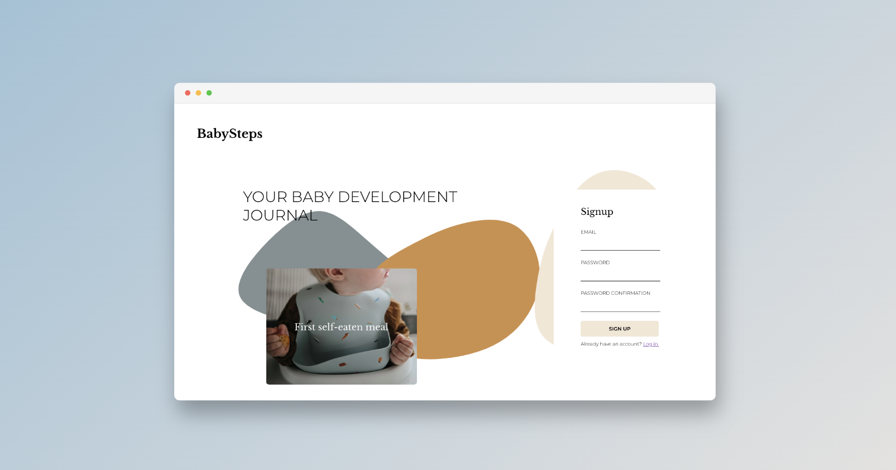
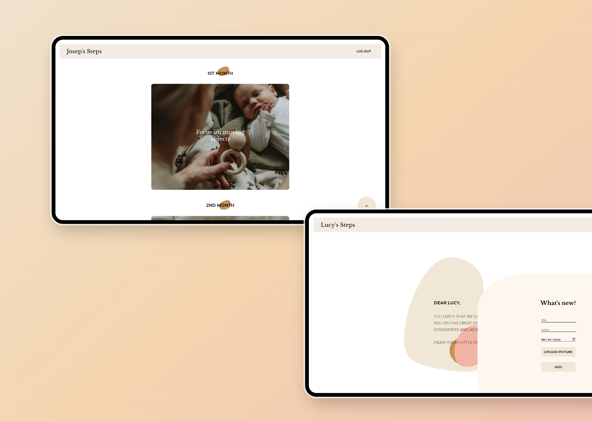

# BabySteps

<p align="center">
  
</p>

Welcome to Baby Steps! This web app is a simple and easy way for parents to track their child's development and milestones.

With Baby Steps, you can store information about your child's achievements and special moments, and even upload corresponding pictures. The app automatically calculates the age of your child for each milestone and adds it to a one-scroll timeline, making it easy to see their progress at a glance.

## Screenshots

<p align="center">
  
</p>

## Installation

1. Clone this repo

   ```bash
   git clone https://github.com/mariarosz/BabySteps.git
   cd client
   ```

2. Install dependencies.

   ```bash
   npm install
   ```

3. Run the app

   ```bash
   npm start
   ```

## Built with

- [React](https://github.com/facebook/react) – Frontend framework for building user interfaces
- [Firebase](https://firebase.google.com/) – Firestore database and authentication
- Other dependencies:
  - [Cloudinary](https://cloudinary.com/) – Image cloud storage and delivery
